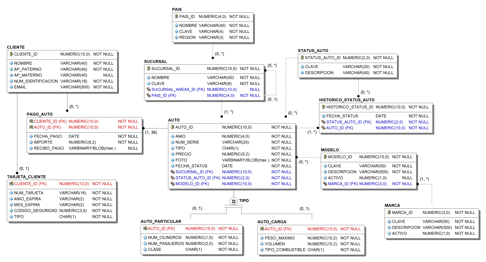
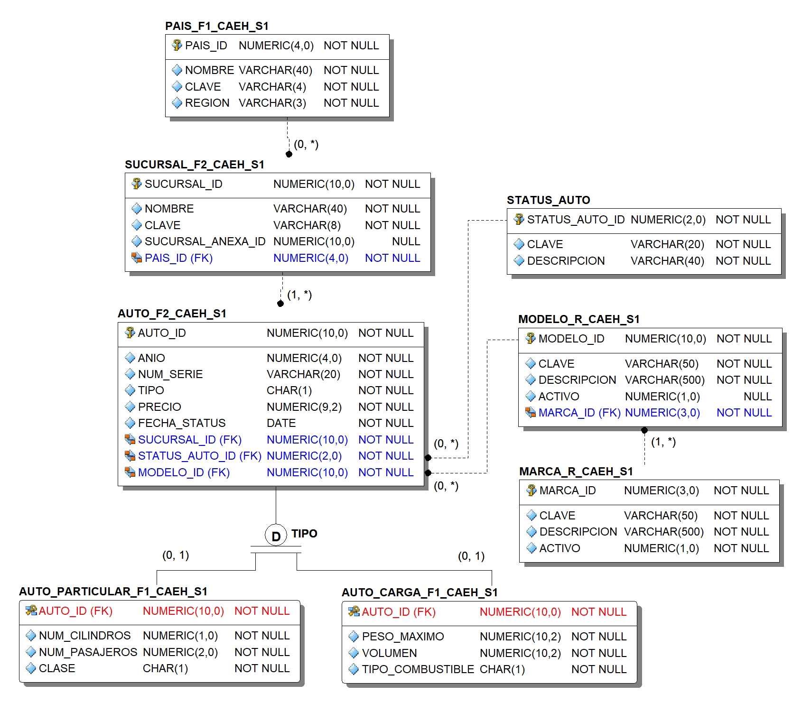
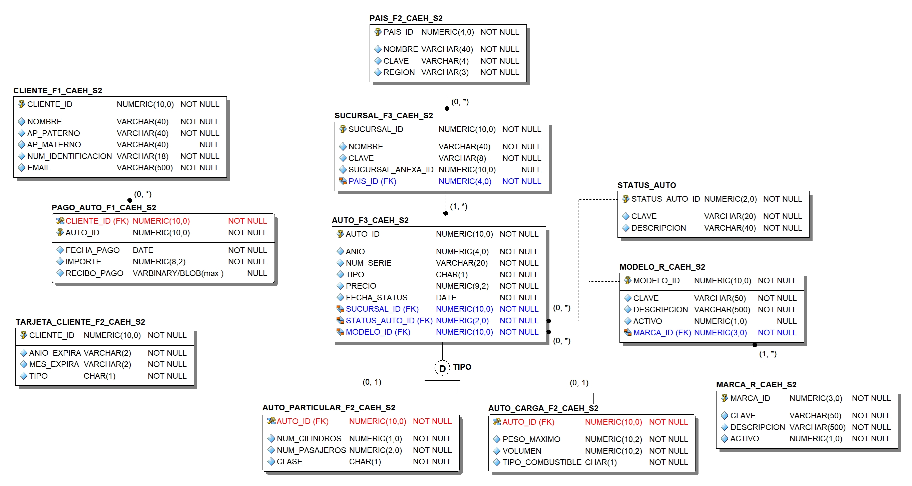
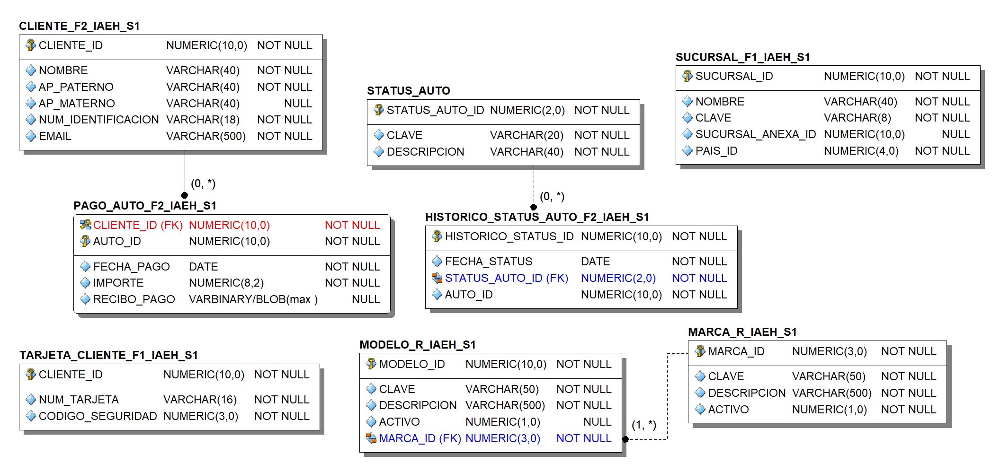
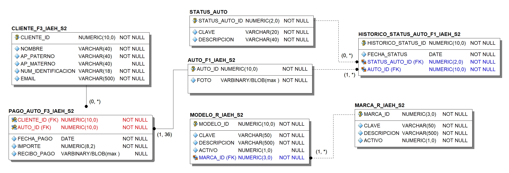

# Proyecto BDD: Agencia de autos

## Caso de estudio

La empresa MiAuto S.A. de C.V. Desea distribuir su BD con base a las siguientes reglas de negocio. MiAuto cuenta con sucursales ubicadas en diferentes partes del mundo. Para cada sucursal se guarda su nombre, clave de 8 caracteres, y el país en donde se encuentra. Existe un catálogo de países en donde se almacena la clave del país (4 caracteres como máximo) su nombre y la región a la que pertenece el país. Las regiones pueden ser AME y EUR.

En cada sucursal se venden autos para lo cual se lleva un registro de cada auto: marca, modelo (no se requieren catálogos para estos 2 campos), año, número de serie (cadena de 18 caracteres) precio del auto, y foto.

Los autos que la empresa ofrece se dividen en 2 tipos principales: Autos particulares y Autos de carga. Solo para los autos de carga se registra el peso máximo que puede transportar, el volumen de la caja de transporte, y el tipo de combustible (D = Diesel, G = Gas). Para los autos particulares se
almacena el número de cilindros, la capacidad de personas que puede transportar, y la clase de auto: S = Sedan, C = Camioneta, M = Mini Sedan. No se requiere generar catálogos para estos 2 atributos. Cada auto es asignado a una sola sucursal en la que se realizará su venta.

La empresa administra a los autos a través de un status: EN CONSTRUCCION, APARTADO, DISPONIBLE, VENDIDO, DEFECTUOSO. Se cuenta con un catálogo de status donde se guarda la clave y la descripción de cada uno de estos valores. El auto puede tomar varios de estos status a lo largo de su
proceso de venta. La empresa requiere saber el status y la fecha en la que se modifica su valor, así como conservar la historia de cambios de status a lo largo del tiempo a través del uso de un histórico.

Cuando un cliente realiza la compra de un auto, se registran los pagos realizados. Pueden ser hasta 36 pagos para el caso de un crédito, o 1 pago como mínimo para el caso de pago de contado. Para cada pago se registra el importe, la fecha de pago y el recibo de pago. Se registran los datos del cliente en caso de no estar registrado: nombre, apellidos, número e identificación (hasta 18 caracteres), email. Para el caso de los clientes que pagan con tarjeta de crédito, la empresa registra los datos de su tarjeta: número, año de expiración, mes de expiración, código de seguridad, tipo de tarjeta (V = VISA; M = MasterCard, A = American Express). Solo se permite registrar una tarjeta por cliente.

Algunas sucursales cuentan o se asocian con otra llamada “sucursal anexa” empleada para realizar actividades administrativas. La sucursal anexa puede o no encontrarse en la misma área geográfica. Se requiere asociar la sucursal anexa a cada sucursal en caso de existir.

|Numero de nodo|Caracteristicas|Nombre global de PDB|Sitio para fragmentos|
|:------------:|:-------------:|:------------------:|:-------------------:|
|1|Ubicado en la region AME, tiene mayor capacidad de procesamiento.|`caehbdd_s1.fi.unam`|`CAEH_S1`|
|2|Ubicado en la region EUR.|`caehbdd_s2.fi.unam`|`CAEH_S2`|
|3|Cuenta con VPN ue conecta al servidor con las oficinas centrales de la empresa, asi como herramientas para cifrado de datos. Ubicado en EUA.|`iaehbdd_s1.fi.unam`|`IAEH_S1`|
|4|Cuenta con herramientas para realizar procesamieno de contenido multimedia, asi como una gran capacidad de almacenamiento.|`iaehbdd_s2.fi.unam`|`IAEH_S2`|

### Requerimientos para distribucion

Para administrar el catálogo de países, se emplea el valor de la región. Países de América (AME) se almacenan en el nodo 1 y países de Europa (EUR) en el nodo 2. Para realizar la administración del catálogo de sucursales, la empresa considera las siguientes situaciones: Existe un conjunto de sucursales consideradas como sucursales administradoras. Todas estas sucursales tienen la característica que los primeros 5 caracteres de su clave corresponden con el carácter ‘0’, es decir: 00000. Para este conjunto de sucursales, la empresa ha decidido ubicarlas en el nodo 3 ya que los dueños de la empresa requieren el uso de la VPN para poder acceder a los datos de este conjunto de sucursales. Para las sucursales restantes, la empresa ha decidido emplear el mismo criterio que el catálogo de países.

Para el caso de los autos se tienen las siguientes consideraciones. Las fotos de los autos deberán almacenarse en el nodo 4 por sus características de procesamiento multimedia. El resto de la información de cada auto debe almacenarse en el mismo sitio donde se encuentra su sucursal asignada. Los datos particulares de los autos de carga y de los particulares se almacenarán en el mismo sitio donde se almacenan los datos generales del auto. Cabe mencionar que a las sucursales administradoras no se les asignan autos por sus funciones de administración. Esto implica que solo se tendrán 2 grupos de autos.

Para el caso del histórico de status, la empresa ha dispuesto que todos los registros con fecha de status del 2010 o anterior, deberán ser enviados al sitio que cuenta con la mayor capacidad de espacio en disco: nodo 4. Los demás registros se enviarán al nodo 3 ya que requiere el uso de la VPN.
Para el caso de los clientes, la empresa decidió distribuirlos en 3 sitios de manera aproximadamente equitativa considerando la primera letra del primer apellido del cliente y los siguientes rangos: [A-I] en el nodo 2, [J-Q] en el nodo 3, [R-Z] en el nodo 4

Para los datos de los pagos del cliente, se cuentan con 2 opciones: distribuir con base a la ubicación de los datos del auto comprado, o con base a la ubicación de los datos del cliente. Discutir en equipo y decidir que opción se elegirá.

Finalmente, la empresa ha decidido que los datos de las tarjetas de los clientes se deberán distribuir de la siguiente forma: El número de tarjeta y el código de seguridad deberán ubicarse en el sitio que tiene las licencias y herramientas necesarias para proporcionar cifrado y resguardo seguro de estos 2 atributos: nodo 3. Para los demás atributos de las tarjetas, los registros se ubicarán en el nodo 2.

Para el caso de los siguientes catálogos la empresa ha decidido realizar las siguientes acciones:
<li>Catálogo de status de auto. Es un catálogo pequeño, fijo y estático por lo que se ha decidido simplemente copiarlo en cada uno de los nodos.
<li>Catálogos de Marcas y Modelos de auto. Ambos son catálogos relativamente pequeños y se actualizan con frecuencia relativamente baja. Para estos casos, la empresa ha decidido aplicar un esquema de replicación simple.
  
### Requerimientos de replicacion y copia de datos:
<li>La tabla STATUS_AUTO conserva su nombre en los 4 nodos ya que se realizará la carga manual en cada uno. No requiere tratamiento alguno.
<li>Para las tablas MARCA Y MODELO, se deberán renombrar por MARCA_R_<INICIALES>_S<N> y MODELO_R_<INICIALES>_S<N> ya que serán replicadas. Más adelante se detallará la estrategia de replicación.
<li>Agregar estas 3 tablas en la tabla de fragmentación indicando como valor para la expresión algebraica la palabra COPIA MANUAL o TABLA REPLICADA según corresponda.

## Diseno logico

### Nodo 1

### Nodo 2

### Nodo 3

### Nodo 4

## Restricciones de referencia

|Nombre de la tabla padre|Nombre de la tabla hija|Sitio|
|:----------------------:|:---------------------:|:---:|
|`PAIS_F1`|`SUCURSAL_F2`|`CAEH_S1`|
|`SUCURSAL_F2`|`AUTO_F2`|`CAEH_S1`|
|`AUTO_F2`|`AUTO_PARTICULAR_F1`|`CAEH_S1`|
|`AUTO_F2`|`AUTO_CARGA_F1`|`CAEH_S1`|
|`STATUS_AUTO`|`AUTO_F2`|`CAEH_S1`|
|`MODELO_R`|`AUTO_F2`|`CAEH_S1`|
|`MARCA_R`|`MODELO_R`|`CAEH_S1`|
|`PAIS_F2`|`SUCURSAL_F3`|`CAEH_S2`|
|`SUCURSAL_F3`|`AUTO_F3`|`CAEH_S2`|
|`AUTO_F3`|`AUTO_PARTICULAR_F2`|`CAEH_S2`|
|`AUTO_F3`|`AUTO_CARGA_F2`|`CAEH_S2`|
|`STATUS_AUTO`|`AUTO_F3`|`CAEH_S2`|
|`MODELO_R`|`AUTO_F3`|`CAEH_S2`|
|`MARCA_R`|`MODELO_R`|`CAEH_S2`|
|`CLIENTE_F1`|`PAGO_AUTO_F1`|`CAEH_S2`|
|`STATUS_AUTO`|`HISTORICO_STATUS_AUTO_F2`|`IAEH_S1`|
|`MARCA_R`|`MODELO_R`|`IAEH_S1`|
|`CLIENTE_F2`|`PAGO_AUTO_F2`|`IAEH_S1`|
|`STATUS_AUTO`|`HISTORICO_STATUS_AUTO_F1`|`IAEH_S2`|
|`MARCA_R`|`MODELO_R`|`IAEH_S2`|
|`AUTO_F1`|`HISTORICO_STATUS_AUTO_F1`|`IAEH_S2`|
|`AUTO_F1`|`PAGO_AUTO_F3`|`IAEH_S2`|
|`CLIENTE_F3`|`PAGO_AUTO_F3`|`IAEH_S2`|
